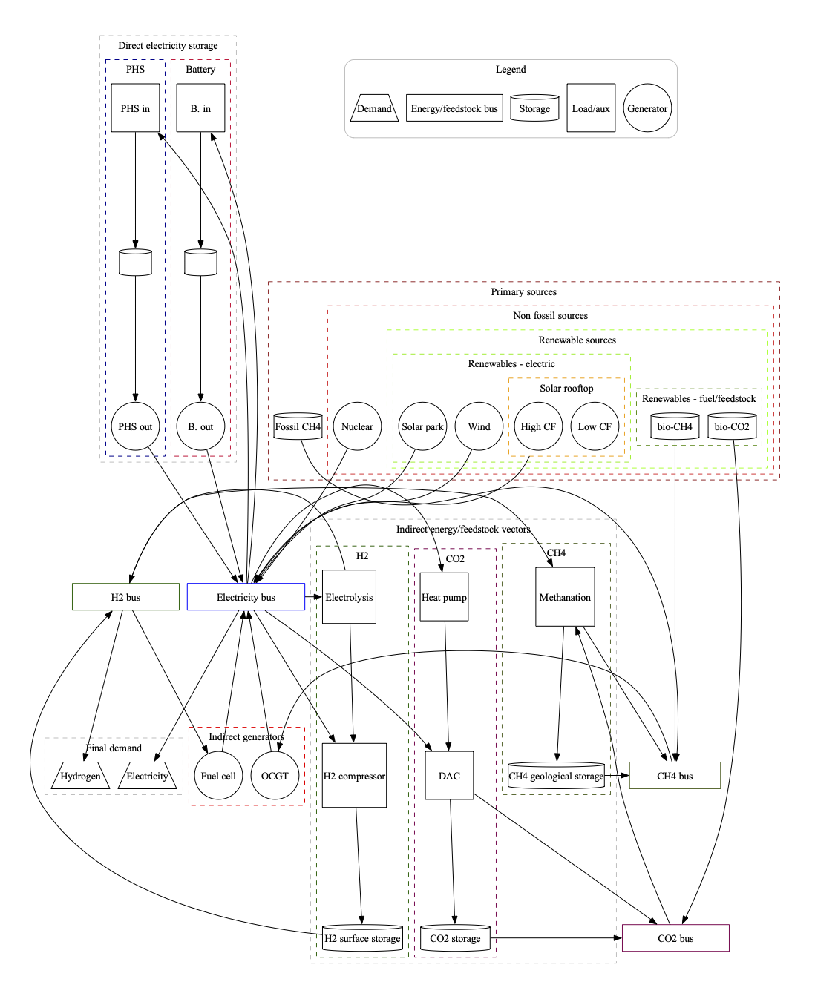

# Nuclear-sized energy district to assess renewable and storage technologies
## Introduction
This code minimizes the system cost of a  nuclear-sized district supplying electricity and an optional service with hydrogen as carrier.

"Nuclear-sized" refers to the default assumption on the served demands:  if the district would deploy nuclear as primary source it would then require a gen III/III+ reactor of ~1.6 GWe.

Beside nuclear, the non-fossil electric technologies that may be activated are:
- onshore wind
- rooftop solar
- ground-based solar

Rooftop solar may be analyzed under two alternative profiles of the hourly capacity factor (CF).
Short, medium and long-term storage technologies are considered along integrative biogenic gases.

For further details, please see the [technical report](./reports/District_baseload_S_Italy.pdf) where the model depicted in the following figure is fully described.


## Open source license and aknowledgments
The code in this repo is MIT licensed, see [`./LICENSE.md`](./LICENSE.md), and it is based on the open source project [PyPSA - Python for Power System Analysis](https://pypsa.readthedocs.io/en/latest/index.html).

The code in its default settings uses input CF files from the open source project [Renewables.ninja](https://www.renewables.ninja/).

## How to install
1. If you already have a working PyPSA environment you may prefer to directly execute the code in it, then go to step 3. If this fails, or you prefer to create ex-novo a python environment, go to step 2.
2. Install the python environment (I tested it with [`mamba`](https://mamba.readthedocs.io/en/latest/), but you can try with your favorite package manager)
```shell
mamba env create -f environment.yml
```
3. Ensure that you have a license of a LP solver compatible with PyPSA. The code assumes Gurobi as the default solver. If you want or need to use a different solver, then you need to:
	- [read the section 'Getting a solver for optimisation' of this PyPSA tutorial](https://pypsa.readthedocs.io/en/latest/installation.html)
    - install the solver and the solver interface in the python environment (follow your solver instructions);
    - modify the code `single_district.py`. In the following assignment use the name of the solver of your choice, the default is:
```python
name_solver = 'gurobi'
```
## How to execute an already existing scenario
1 Activate the environment `single_district` (or your existing PyPSA env):
```shell
conda activate single_district
```
2 In the subfolder [scenarios_and_results](./scenarios_and_results) there are several yaml files with already defined scenarios.
For example, to execute  `Scenario_A.yaml` from the command line type in the main directory the following (there is not need to specify the path)
```shell
python single_district.py -s Scenario_A
```

## How to define new scenarios
There are three ways, depending on your objectives.
1. If the objective is exploring scenario variants given the default techno-economic parameters, then it is simple: define a new scenario by a new yaml file and execute it.
2. If you want to explore new parameter sets you need to modify the techno-economic csv files in the subfolders [data](./data) and [data_ren_ninja](./data_ren_ninja).
3. If you want to modify the structure of the model, for example adding sub-systems or defining new links, then you need to modify the code in `single_district.py`. This may not be straightforward, even if you already know how to code in PyPSA, since the code uses custom procedures for the post-optimization analysis and mapping errors between the new defined model features and these post-opt procedures may occur.

## Output examples
Please, refer to Section XX of the [technical report](./reports/District_baseload_S_Italy.pdf) where the code output is fully described. The following figures are provided here for your convenience.
The  subfolder [scenarios_and_results](./scenarios_and_results) contains pdf files of the solved scenarios.
