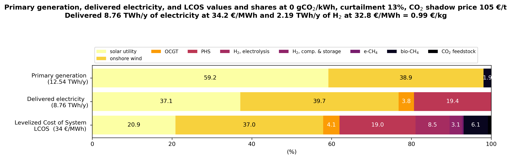
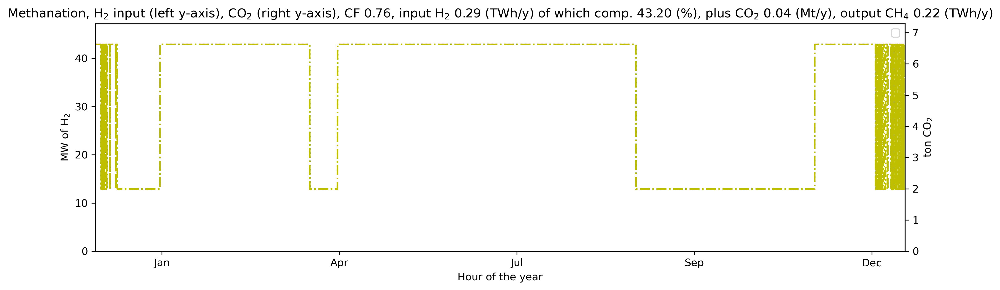

# Nuclear-sized energy district to assess renewable and storage technologies
## Introduction
This code minimizes the system cost of a  nuclear-sized district supplying electricity and an optional service with hydrogen as carrier.

"Nuclear-sized" refers to the default assumption on the served demands:  if the district would deploy nuclear as primary source it would then require a gen III/III+ reactor of ~1.5 GWe.

Beside nuclear, the non-fossil electric technologies that may be activated are:
- onshore wind
- rooftop solar
- ground-based photovoltaic (GPV), also referred as *solar utility*

Rooftop solar may be analyzed under two alternative profiles of the hourly *capacity factor* (CF).
Short, medium and long-term storage technologies are considered along integrative biogenic gases.

For further details, please see the [technical report](./reports/District_baseload_S_Italy.pdf) where the model depicted in the following figure is fully described.


## Open source license and aknowledgments
The code in this repo is MIT licensed, see [`./LICENSE.md`](./LICENSE.md), and it is based on the open source project [PyPSA - Python for Power System Analysis](https://pypsa.readthedocs.io/en/latest/index.html).

The code in its default settings uses input CF files from the open source project [Renewables.ninja](https://www.renewables.ninja/).

## How to install
1. If you already have a working PyPSA environment you may prefer to directly execute the code in it, then go to step 3. If this fails, or you prefer to create ex-novo a python environment, go to step 2.
2. Install the python environment (I tested it with [`mamba`](https://mamba.readthedocs.io/en/latest/), but you can try with your favorite package manager)
```shell
mamba env create -f environment.yml
```
3. Ensure that you have a license of a LP solver compatible with PyPSA. The code assumes Gurobi as the default solver. If you want to use a different solver, then you need to:
	- [read the section 'Getting a solver for optimisation' of this PyPSA tutorial](https://pypsa.readthedocs.io/en/latest/installation.html)
    - install the solver and the solver interface in the python environment (follow your solver instructions);
    - modify the code `single_district.py`. In the following assignment use the name of the solver of your choice, the default is:
```python
name_solver = 'gurobi'
```
## How to execute an already existing scenario
1. Activate the environment `single_district` (or your existing PyPSA env):
```shell
conda activate single_district
```
2. In the subfolder [scenarios_and_results](./scenarios_and_results) there are several yaml files with already defined scenarios.
For example, to execute  `Scenario_A.yaml` from the command line type in the main directory the following (there is not need to specify the path)
```shell
python single_district.py -s Scenario_A
```

## How to define new scenarios
There are three ways, depending on your objectives.
1. If the objective is exploring scenario variants given the default techno-economic parameters, then it is simple: define a new scenario by a new yaml file and execute it.
2. If you want to explore new parameter sets you need to modify the techno-economic csv files in the subfolders [data](./data) and [data_ren_ninja](./data_ren_ninja). [A how-to guide for the renewable availability profile here](./data_ren_ninja/Readme.md)
3. If you want to modify the structure of the model, for example adding sub-systems or defining new links, then you need to modify the code in `single_district.py`. This may not be straightforward, even if you already know how to code in PyPSA, since the code uses custom procedures for the post-optimization analysis and mapping errors between the new defined model features and these post-opt procedures may occur.

## Output examples
Please, refer to Section 5 of the [technical report](./reports/District_baseload_S_Italy.pdf) where the code output is fully described.
The  subfolder [scenarios_and_results](./scenarios_and_results) contains png files of all the solved scenarios.
The following figures are provided here for your convenience.
These results refer to a scenario where there are no vetoes to land-based wind and solar, and biogenic gases are allowed.

### Main indices
The following figure illustrates the main performance indices of the minimum system cost solution.
The three bars report the percentage contribution of the technologies to the following system values, from top to bottom: primary generation,  delivered electricity, and unitary cost of the delivered services.
These three system values are listed as labels in the left vertical axis.
The unitary cost index is indicated as *Levelized Cost of System* (LCOS), is expressed in euro per MWh, and refers to the weighted average of electricity and hydrogen costs.
For legibility we do not include in the bars the numerals of percentages lower than 1.5%.
The figure title lists the following additional performance indices of the optimal solution.
First, the CO2 emission factor, which is zero in this scenario that includes a full decarbonization constraint.
Curtailment is reported next as percentage of the primary generation of electricity.
The shadow price of CO2  is expressed in euro per ton.
The delivered quantities and costs of the two energy services are expressed in TWh per year and euro per unit of energy, respectively. For hydrogen a cost equivalence in euro per unit of mass is also indicated.
The system cost minimization yields the LCOS, which is the equivalent objective function since the quantities of the delivered energy services are input parameters.
Comparing the decomposition by technology of the three bars highlights the relative cost contribution.
For example, in this scenario solar requires only 21% of the LCOS while providing 37% of the dispatched electricity and 59% of the primary generation.
The disaggregation of the LCOS in the costs of the two energy services, electricity and hydrogen, allows to answer the question if the district can competitively supply industrial plants.
While the delivered electricity and hydrogen are input parameters, the primary generation and curtailment are results of the system cost minimization.
The primary generation compounded by the curtailment rate provides insights on the effective environmental impact of the energy production.


### Installed capacities
The following figure shows the capacities of the installed technologies.
Power capacities are depicted in yellow and blue for the input and output, respectively.
The power scale is the top horizontal axis with MW as unit.
For DAC, a technology with mass flow as output, the unit is ton of CO2 per hour.
The output of e-CH4 refers to the link between the geological storage and the methane bus, and this is generally one order of magnitude larger than the output of the methanation plant itself (details of the methanation plant are provided by an additional figure in the following).
The storage capacities, of energy or mass, are reported as red bars and their scale is the bottom horizontal axis with MWh or ton of CO2 as unit. This scale is logarithmic.
The red bars are labeled with the maximum duration of discharge, expressed in hours.
This index is the ratio between the installed energy and power output capacities.


### State of charge of storage
The following figure depicts the hourly state of charge of the installed storage technologies.
The vertical axis is in logarithmic scale. The legend reports the yearly rotation rate of the installed storage capacity of each technology.
For storage technologies, this and the previous figure show the interplay of the yearly rotation rate and maximum discharge in the system optimization. Technologies optimally configured with low discharge rates  tends to have high rotation rates, and vice versa.
This comparison should clarify why some studies fail in properly optimize renewable-based energy systems: they pre-assign non optimal roles to storage technologies, such as for example, setting batteries for long discharge and low rotation rate or electrolysis for short discharge and high rotation rate.


### Cost structures and prices
The following figure shows the cost structure and price per unity of service delivered of each installed technology.
The unitary cost is the sum of the following three components:
- CAPEX + FO&M,  the investment annuity and the fixed operations and management costs.
- VO&M, the variable operations and management costs.
- input, the cost of the inputs. For example, the electrolysis input cost is the cost of the required electricity, and the input cost of methanation is the cost of the required hydrogen and CO2.

Each unitary cost bar indicates in its label the net capacity factor of the technology.
The net capacity factor is a result of the optimization, and refers to the useful generation excluding curtailment.
The average price per unity of service delivered is indicated as a black diamond.
This average price is derived by the dual variables of the linear program.
Observe that in this scenario there are no active constraints on the minimum capacity of technologies.
Therefore, each installed technology satisfies equality between costs and revenues, i.e. there is cost-price parity [Brown and Reichenberg, 2021](https://www.sciencedirect.com/science/article/pii/S0140988321002607).
.


### Cost-revenue balances
The following figure illustrates the cost-revenue balance for each technology.
Observe how technologies with a high unitary cost/price in the previous figure play a minor role when they are ranked by their revenue.


###  Duration curve of the electricity price
The following figure illustrates the duration curve of the hourly electricity prices (logaritmic scale).
We observe that in three fourths of the time the price is very low. This share coincides with that of wind and solar in the dispatched electricity see mid bar of the main indices figure.
The remaining fourth of the time exhibits increasing prices depending on the marginal cost of storage.
Thus, the average yearly price remains low although some hours face high prices to remunerate storage sub-systems.
The cost-price figure indicates that the most expensive electricity supply in this scenario is by OCGT with a net CF of 9% and an average price of 140 €/MWh.
Although this technology is expensive, it is cheaper than a hypothetical nuclear with CF of 9% which will cost ca. 800 €/MWh.
This is why nuclear does not enter the optimal mix, and it displays lower than maximum CF when (in other scenarios) competes with partially vetoed renewables. The marginal cost of nuclear, albeit low, is not near zero as for wind and solar.
This system dynamics is well known and leads some authors to be skeptical of a relevant role of nuclear in the first half of this century [Haywood et al., 2023](https://www.cell.com/joule/abstract/S2542-4351(23)00281-7).


### Investment
The following figure decomposes the total investment in the district by technologies.


### Operation of the methanation plant
The following figure provides operational details of the methanation plant. Observe that methanation is modeled as continuous process with a 30% minimum capacity factor.

