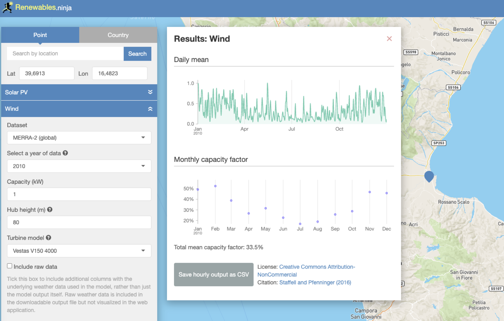
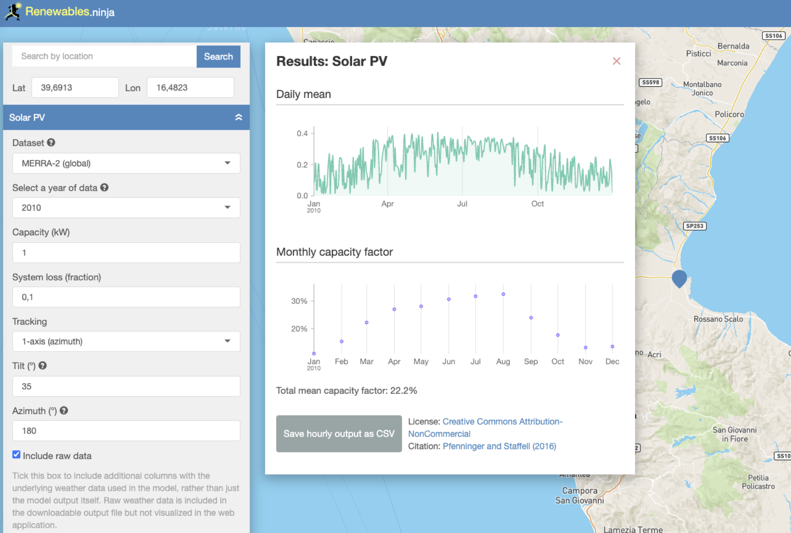

# How to modify the solar and wind availability profiles

1. Go to the [website Renewables.ninja](https://www.renewables.ninja/).
2. Select the location and type of solar/wind plant that you want to test
3. Download the corresponding csv files
4. Please, note that the code assumes that all availability files refer to the same metereological year, otherwise an error will occur.
5. Put the csv files in this directory.
6. Create a scenario yaml file where you link these files, for example
```python
wind_file_name_and_path : "./data_ren_ninja/Sibari_MERRA2_2010_Wind_V150_4000_CF33_5_ninja_wind_39.6913_16.4823_corrected.csv"
```
7. Specify in the yaml file the field for the meteo year, for example, if the year is 2010 (this is the default setting):
```python
year_ninja               : 2010
```
## Examples of csv extraction from Renewables.ninja

### The onshore wind availability profile


### The solar utility availability profile

